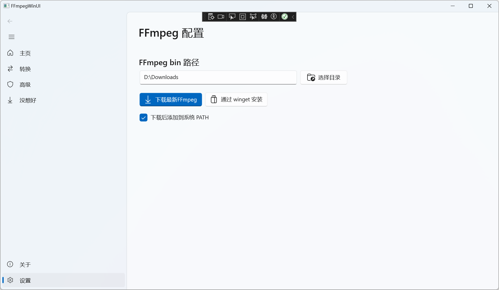

# FFmpegWinUI - WinUI 3 FFmpeg 管理工具

FFmpeg 管理与命令，基于 WinUI 3 开发。提供直观的界面来配置和管理 FFmpeg，让 FFmpeg 的安装和使用变得简单。

## 截图

## 鸣谢
此项目部分代码源自优秀的开源项目

**借鉴的开源项目**

- [liubili/FFmpegWinUI: FFmpegWinUI是一个WinUI3的FFmpeg面板](https://github.com/liubili/FFmpegWinUI)

## 开发环境

1. **必需组件**

   - Visual Studio 2022
   - Windows App SDK
   - WinUI 3 工具

2. **运行项目**

   首次运行需要右键项目`属性->配置属性->调试->本地计算机`

## 注意

⚠️：此项目只用于学习现代C++，在作为一个实践项目的同时，了解C++的一些新特性。欢迎贡献代码一起学习！

